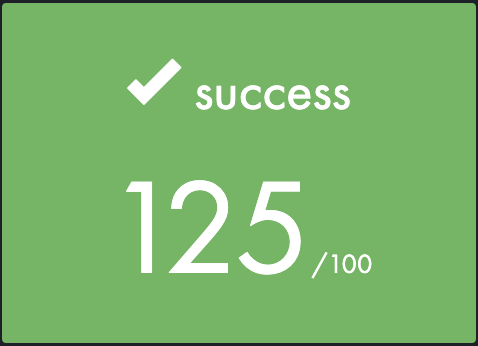

# So Long

 
	

## Summary
This project is a very small 2D game. Its purpose is to make you work with textures, sprites, and some other very basic gameplay elements.

## Objectives
"So Long" will help you improve your skills in the following areas: window management, event handling, colors, textures, and more.

You are going to use the school graphical library: the MiniLibX! This library was developed internally and includes the basic necessary tools to open a window, create images, and deal with keyboard and mouse events.

## Mandatory Part
### Game
- The player's goal is to collect every collectible present on the map, then escape by choosing the shortest possible route.
- The W, A, S, and D keys must be used to move the main character.
- The player should be able to move in four directions: up, down, left, and right.
- The player should not be able to move into walls.
- At every move, the current number of movements must be displayed in the shell.
- You have to use a 2D view (top-down or profile).
- The game doesn't have to be real-time.

### Graphic Management
- Your program has to display the image in a window.
- The management of your window must remain smooth.
- Pressing ESC must close the window and quit the program in a clean way.
- Clicking on the cross on the window's frame must close the window and quit the program in a clean way.
- The use of the images of the MiniLibX is mandatory.

### Map
- The map has to be constructed with three components: walls, collectibles, and free space.
- The map can be composed of only these five characters:
  - 0 for an empty space
  - 1 for a wall
  - C for a collectible
  - E for a map exit
  - P for the player's starting position
- The map must contain 1 exit, at least 1 collectible, and 1 starting position to be valid.
- The map must be rectangular.
- The map must be closed/surrounded by walls. If it's not, the program must return an error.
- You have to check if there's a valid path in the map.
- If any misconfiguration of any kind is encountered in the file, the program must exit in a clean way and return an error message.

## Bonus Part
- Make the player lose when they touch an enemy patrol.
- Add some sprite animation.
- Display the movement count directly on the screen instead of writing it in the shell.
